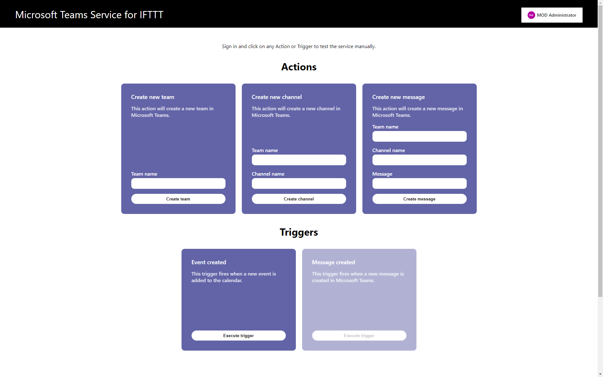
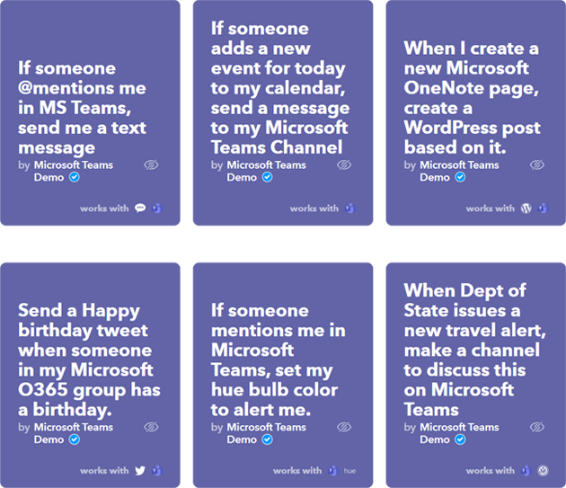

# Microsoft Graph Service for IFTTT

This sample is a demonstration of what a [Microsoft Graph](https://developer.microsoft.com/graph) service on [IFTTT](https://ifttt.com/) could look like. The purpose is to spark exploration by third parties to integrate their products with the Microsoft Graph and leverage the IFTTT platform to utilize the rich set of data (ie. Teams, OneNote, Calendar, User data, analytics, etc…) available in typical M365 organizations. 

## What is IFTTT?

> [IF-This-Then-That](https://ifttt.com/) is the free way to do more with hundreds of the apps and devices you love, including Twitter, Dropbox, Evernote, Nest, Fitbit, [and more]  *-- IFTTT site*

These items, called services, are chained together very easily on IFTTT to create sometimes complex conditional chains, called Applets.
>An Applet connects two or more apps or devices together. It enables you to do something that those apps or devices couldn't do on their own. IFTTT enables your business to create the connected experiences customers want, at a fraction of the cost. *-- IFTTT site*

An applet is triggered by new items, events, or changes to existing items within the "This" part of the services.  "Then", the *action* on the service which was attached as the "That" part of the applet is fired. If this service's *trigger* is fired, execute the *action* on this other service; this is a common model of IFTTT Applets.

## This Sample
This project consists of a pre-built node.js service that is ready to integrate with the IFTTT platform. It supports several IFTTT Actions and Triggers focused around integration with the Microsoft Teams, OneNote, Calendar, and other elements of M365 products.

To learn more about what the service can do, follow the [project setup instructions](docs/project-setup.md) then visit http://localhost:8080/ to try the service out for yourself!

If you plan on implementing your own triggers and actions with this code, here's some interesting tidbits that may make this much easier.
- We have provided some simple base classes that will automatically format the responses to IFTTT in a way that meets their requirements. These classes are the [trigger response class](src\models\trigger-response-model.ts) and the [options response class](src\models\options-response-model.ts). They will format the JSON payload back to IFTTT correctly with little effort on your part.
- We have provided a [Graph Client class](src\helpers\graph-client.ts) that allows you to use the official Graph SDK in your classes. This takes the incoming auth key from IFTTT and creates a custom provider for the Graph Client to use.
- There is also some [middleware](src\helpers\middleware.ts) for use in the responses to IFTTT that will ease the work of checking things like Service Key and Auth Key validation.

# Contributing

This project welcomes contributions and suggestions. 
How you can help:
- File issues to alert us to possible improvements
- Fix issues already in our issue list
- Suggest and/or create new improvements via Pull Request
- Use this sample to create something great and let us know!

Most contributions require you to
agree to a Contributor License Agreement (CLA) declaring that you have the right to,
and actually do, grant us the rights to use your contribution. For details, visit
https://cla.microsoft.com.

When you submit a pull request, a CLA-bot will automatically determine whether you need
to provide a CLA and decorate the PR appropriately (e.g., label, comment). Simply follow the
instructions provided by the bot. You will only need to do this once across all repositories using our CLA.

This project has adopted the [Microsoft Open Source Code of Conduct](https://opensource.microsoft.com/codeofconduct/).
For more information see the [Code of Conduct FAQ](https://opensource.microsoft.com/codeofconduct/faq/)
or contact [opencode@microsoft.com](mailto:opencode@microsoft.com) with any additional questions or comments.